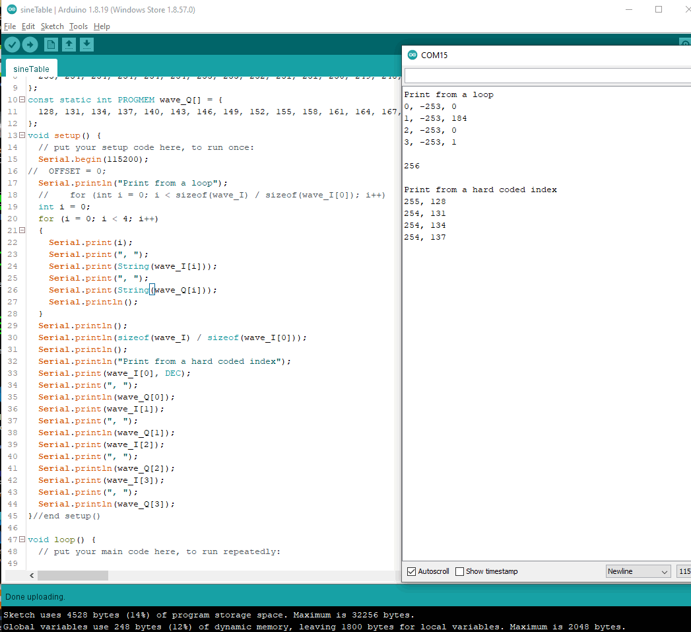

# sineTable
An experiment to make a table in PROGMEM with sine and cosine.

Screen shot after the fix. 
Now workihg using "pgm_read_word_near(wave_I + i)"

Screen shot showing how the first few elements are wroing when read in a FOR loop.

